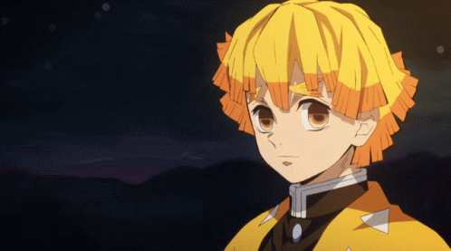

<body>

<h1 align="center"> {"type":"textbox","version":"3.4.0","originX":"left","originY":"top","left":601.4300235926,"top":98.0387685291,"width":714.4826111745,"height":45.2,"fill":{"type":"linear","coords":{"x1":0,"y1":45.199999999999996,"x2":714.4826111744583,"y2":45.199999999999996},"colorStops":[{"offset":0,"color":"rgb(136, 50, 177)","opacity":1},{"offset":0.551219512195122,"color":"rgb(0, 0, 0)","opacity":1},{"offset":0.9560975609756097,"color":"rgb(136, 50, 177)","opacity":1}],"offsetX":0,"offsetY":0,"gradientUnits":"pixels","angle":0},"stroke":null,"strokeWidth":0,"strokeDashArray":null,"strokeLineCap":"butt","strokeDashOffset":0,"strokeLineJoin":"miter","strokeMiterLimit":4,"scaleX":1,"scaleY":1,"angle":0,"flipX":false,"flipY":false,"opacity":1,"shadow":{"color":"rgba(0, 0, 0, 0)","blur":0,"offsetX":0,"offsetY":0,"affectStroke":false,"nonScaling":false},"visible":true,"clipTo":null,"backgroundColor":"","fillRule":"nonzero","paintFirst":"fill","globalCompositeOperation":"source-over","transformMatrix":null,"skewX":0,"skewY":0,"text":"Welcome to my profile","fontSize":40,"fontWeight":"normal","fontFamily":"Mockofun Ribbon","fontStyle":"normal","lineHeight":1.16,"underline":false,"overline":false,"linethrough":false,"textAlign":"center","textBackgroundColor":"rgb(255, 255, 255)","charSpacing":0,"minWidth":20,"splitByGrapheme":false,"selectable":true,"evented":true,"bevel":{"id":1633,"active":false,"size":5.1,"lightColor":"rgb(255, 255, 255)","surfaceScale":5,"specularConstant":1,"lightPositionX":0,"lightPositionY":0,"dirty":true,"object":{"canvas":{"width":1920,"height":1080}}},"innerShadow":{"id":1634},"styles":{}} </h1>

</body>
