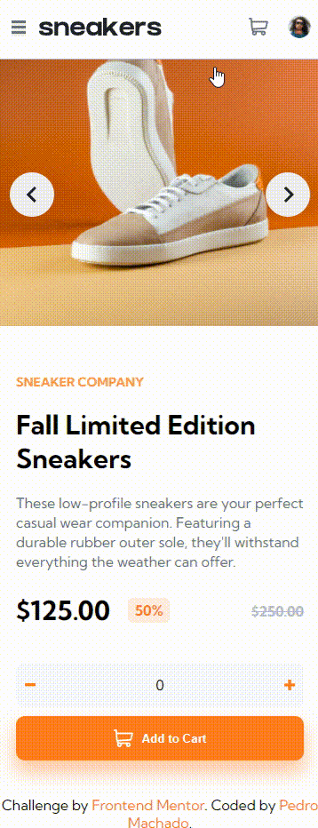

<h1 align="center"> 👋 Welcome to my profile! 👋 </h1>

 

<h2 align="center">📝 About me 📝</h2>
 
 

 My name is Pedro, i'm 25 years old and i'm writing this from Rio, Brazil! 🍻

<h3> Hobbies 💜</h3>
<ul>
    <li> 🎵 Music </li>
    <li> 🎮 Games (RPG, open world, sandbox) </li>
    <li> 🎬 Movies </li>
    <li> 🎬 TV shows </li>
    <li> 👾 Animes </li>
    <li> i also love pets! 😸</li>
</ul>

<h3> 📚 Currently Studying 📚</h3>

<ul>
    <li> 💻 Nextjs, nodeJS 💻 </li>
    <li> Headless CMS: Strapi & Contentful </li>
</ul>

 
 

<h2 align="left">👨‍💻 Knowledge 👨‍💻</h2>

 
 

 

 

    

 
 
 
<h2> 💻 Some Projects 💻</h2>
<table>
    <tr>
        <td>
            <h3>Space Tourism</h3>
            
            
            
<b>Multi-page website created with React + Framer-motion</b>

            
<b>React, CSS, JS, Framer-motion, React-Router-Dom</b>

            <a href='https://github.com/phmac7/Space-Tourism'>Repository</a> 
            <a href='https://phmac7-space.netlify.app/'>LIVE SITE</a>
        </td>
    </tr>
    <tr>
        <td>
            <h3>E-commerce Product</h3>
            
            
            
<b>E-commerce product page w/ cart functionality</b>

            
<b>React, SASS, JS, Framer-motion </b>

            <a href='https://github.com/phmac7/Ecommerce-Product-Page'>Repository</a> 
            <a href='https://phmac7-ecommerceproduct.netlify.app/'>LIVE SITE</a>
        </td>
    </tr>
</table>

 
<h2> ✨ Thanks for reading! ✨ </h2>

</body>
