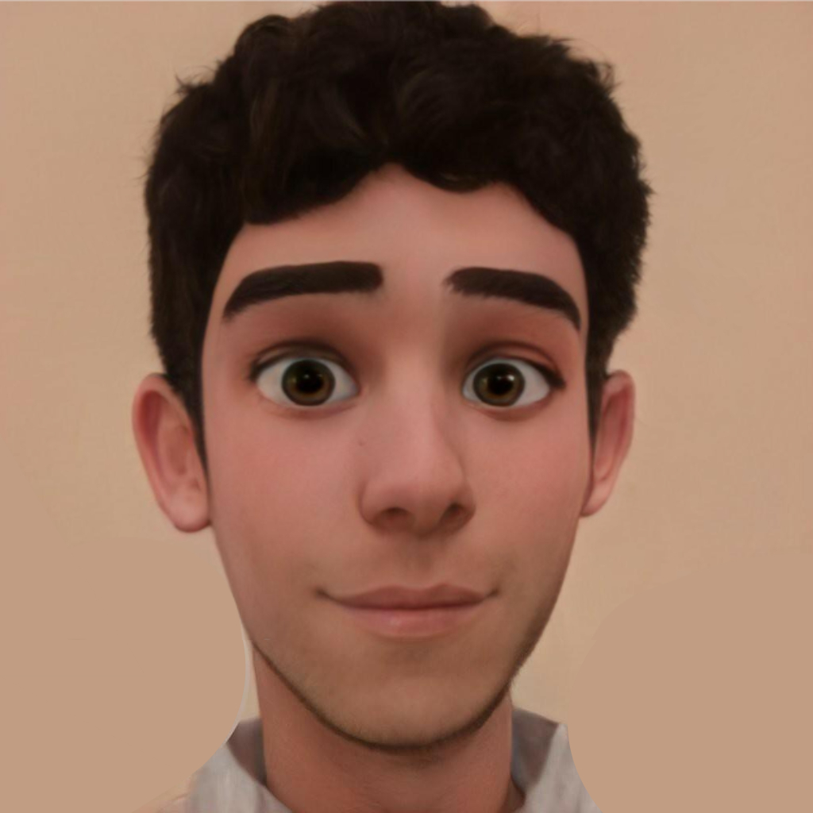

<h1 align="center"> 👋 Welcome to my profile! 👋 </h1>

 

<h2 align="center">📝 About me 📝</h2>
 
 

 My name is Pedro, i'm 24 years old and writing this from Rio, Brazil! 🍻

<h3> Hobbies 💜</h3>
<ul>
    <li> 🎵 Music </li>
    <li> 🎮 Games (RPG, open world, sandbox) </li>
    <li> 🎬 Movies </li>
    <li> 🎬 TV shows </li>
    <li> 👾 Animes </li>
    <li> i also love pets! 😸</li>
</ul>

<h3> 📚 Currently Learning 📚</h3>

<ul>
    <li> 📱 Front-end 💻 </li>
    <li> 📱 Web Development 💻 </li>
</ul>

 
 

<h2 align="left">👨‍💻 Knowledge 👨‍💻</h2>

github.com/devicons/devicon/blob/master/icons/html5/html5-original-wordmark.svg" width="70" alt ="html5">
github.com/devicons/devicon/blob/master/icons/css3/css3-original-wordmark.svg" width="70" alt ="css">

</body>
